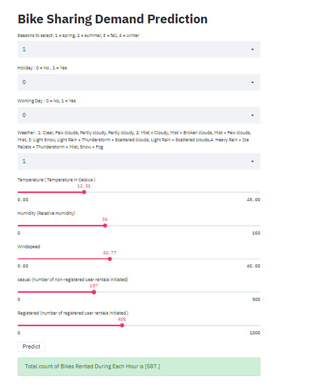

# WebApp-with-Streamlit-and-Python 
## Streamlit is an open-source app framework for Machine Learning and Data Science projects, Which helps you to view your projects in the Web Application.

## This is a WebApp of data set of Bike Sharing Demand Prediction   with its help this model predicts total number of bikes rented .

## To run in your local system, install the required packages from requirements.txt file.